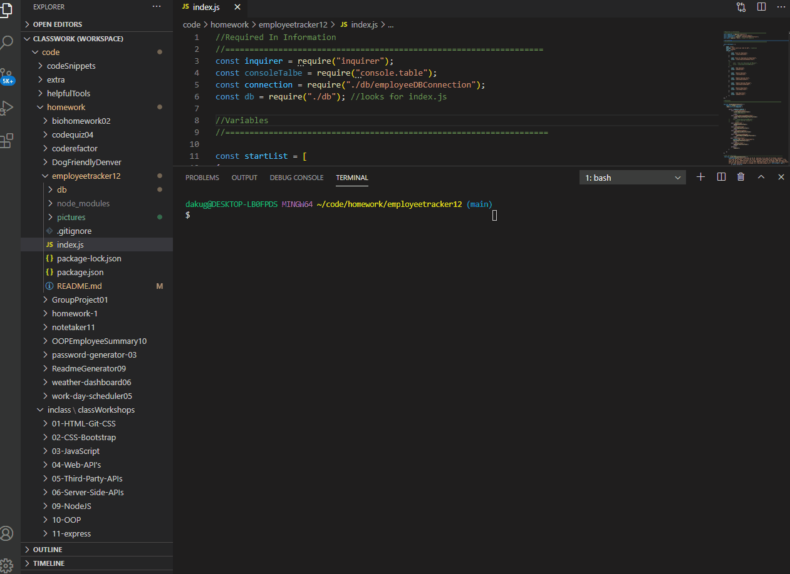
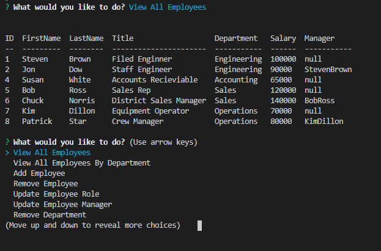

# employeetracker12

## Description 

This homework assignment helps hightlight how databases are used to store data, and how you update, change, and export the data you need. The database used is is MySQL Workbench. This is where I uploaded data in tables and then minuplated that data using JavaScript. 

This project takes user input using inquiere and creates a employee tracking device that allows the user to view all employees, add employees, delete employees, add new departments, etc. All of the data being updated comes from Workbench and is linked using require(mysql). This project helps highlight how JavaScript is used with MySQL and how data can be obtained from databases. 

## Table of Contents 

* [Video](#video)
* [Installation](#installation)
* [Usage](#usage)
* [Credits](#credits)
* [License](#license)
* [Questions](#questions)

## Video

Video of the

## Installation

Steps to install my project include:
* npm install the dependencies 

## Usage 

* This is the start screen with all of the employees printed out. 

## Credits

All of the code was developed by Dana Kuglin. Information about her GitHub profile and how you can contact her are listed below in the questions section.  

## License

This project is licensed under MIT.

## Questions

GitHub Username: dakuglin
GitHub Profile: (https://github.com/dakuglin)

Please email me with additional questions at dakuglin@gmail.com  

    